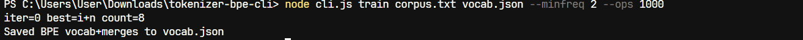

# BPE Tokenizer CLI (Educational)

This repository contains a small **Byte-Pair Encoding (BPE) tokenizer** implemented in JavaScript for the command line.  
It is designed as an **educational tool** — not a production-grade tokenizer — but it's fully runnable and demonstrates the full pipeline:

- Training merges from a corpus
- Saving vocab + merges
- Tokenizing text into subword pieces
- Encoding to IDs
- Decoding back to text

---

## 📂 Files included
- `tokenizer-bpe.js` : BPE tokenizer implementation
- `cli.js` : Command-line wrapper for training, encoding, decoding, tokenizing, and info
- `corpus.txt` : Small sample corpus
- `package.json` : npm metadata
- `vocab_example.json` : Example vocab + merges (generated by running `train`)
- `README.md` : This file

---

## ⚡ Quick start (local)




```bash
# 1. Extract the zip (if applicable) or clone the repo
# 2. Make the CLI executable (optional on Windows)
chmod +x cli.js

# 3. Train (creates vocab.json)
node cli.js train corpus.txt vocab.json --minfreq=2 --ops=2000

# 4. Encode
node cli.js encode vocab.json "Hello world!"


# 5. Tokenize (see subword pieces)
node cli.js tokenize vocab.json "Hello world!"

# 6. Decode (example: replace <ids> with output from encode)
node cli.js decode vocab.json <ids>

